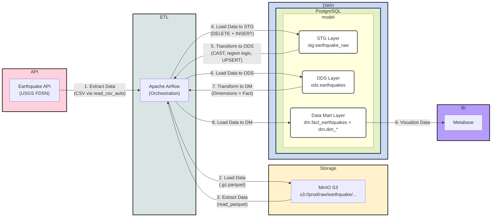

# pet_project_earhquake

Pet-проект по дата-инжинирингу для построения аналитического контура по землетрясениям на основе открытых данных USGS.

Проект реализует полный ETL/ELT-процесс: данные забираются из внешнего API, сохраняются в объектное хранилище, загружаются в staging-слой, затем преобразуются в ODS и агрегируются в витринный (DM) слой по модели «звезда» для последующей аналитики и визуализации.

Оркестрация пайплайнов выполняется в Apache Airflow через набор взаимосвязанных DAG'ов. Для локальной инфраструктуры используются Docker Compose, MinIO (S3-совместимое хранилище), PostgreSQL (DWH) и Metabase (BI-слой).

Основная цель проекта - отработать практический подход к построению многоуровневого DWH-пайплайна с идемпотентной загрузкой, декомпозицией по слоям данных и подготовкой данных для BI-отчетности.

## Создание виртуального окружения

```bash
python3.12 -m venv venv && \
source venv/bin/activate && \
pip install --upgrade pip && \
pip install -r requirements.txt
```

## Разворачивание инфраструктуры

```bash
docker-compose up -d
```

## Предварительная настройка MinIO and PostgreSQL в Airflow

После старта контейнеров необходимо настроить доступы, которые используются DAG-ами.

1. Откройте MinIO (`http://localhost:9001`) и войдите с дефолтными данными:
   - login: `minioadmin`
   - password: `minioadmin`
2. В MinIO создайте пару ключей доступа:
   - `access key`
   - `secret key`
3. Откройте Airflow (`http://localhost:8080`) и войдите с дефолтными данными:
    - login: `airflow`
    - password: `airflow`
4. В Airflow перейдите в `Admin -> Variables` и создайте переменные:
    - `access_key` - значение `access key` из MinIO
    - `secret_key` - значение `secret key` из MinIO
    - `pg_password` - `postgres` (как указано в `docker-compose.yaml` для `postgres_dwh`)
5. В Airflow перейдите в `Admin -> Connections` и создайте подключение к DWH:
   - Connection Id: `postgres_dwh`
   - Connection Type: `Postgres`
   - Host: `postgres_dwh`
   - Database: `postgres`
   - Login: `postgres`
   - Password: `postgres`
   - Port: `5432`

Без переменных и подключения `postgres_dwh` DAG-и не смогут корректно подключаться к MinIO и PostgreSQL.

## Источники

- [Описание работы API](https://earthquake.usgs.gov/fdsnws/event/1/#methods)
- [Описание полей из API](https://earthquake.usgs.gov/data/comcat/index.php)

## Диаграмма проекта



## SQL схемы и таблицы

Ниже приведен DDL для текущей модели данных (`stg` -> `ods` -> `dm`).

DDL схем:

```sql
CREATE SCHEMA ods;
CREATE SCHEMA dm;
CREATE SCHEMA stg;
```

DDL `stg.earthquake_raw`:

```sql
CREATE TABLE stg.earthquake_raw
(
    loaded_at         timestamp default now(),
    time              text,
    latitude          text,
    longitude         text,
    depth             text,
    mag               text,
    mag_type          text,
    nst               text,
    gap               text,
    dmin              text,
    rms               text,
    net               text,
    id                text,
    updated           text,
    place             text,
    type              text,
    horizontal_error  text,
    depth_error       text,
    mag_error         text,
    mag_nst           text,
    status            text,
    location_source   text,
    mag_source        text
);
```

DDL `ods.earthquakes`:

```sql
CREATE TABLE ods.earthquakes (
    id                VARCHAR(50) PRIMARY KEY,
    event_time        TIMESTAMP WITH TIME ZONE,
    updated_at        TIMESTAMP WITH TIME ZONE,
    latitude          NUMERIC(12, 8),
    longitude         NUMERIC(12, 8),
    depth             NUMERIC(10, 4),
    mag               NUMERIC(5, 2),
    mag_type          VARCHAR(20),
    nst               INTEGER,
    gap               NUMERIC(6, 2),
    dmin              NUMERIC(8, 4),
    rms               NUMERIC(6, 3),
    horizontal_error  NUMERIC(10, 5),
    depth_error       NUMERIC(10, 5),
    mag_error         NUMERIC(10, 5),
    mag_nst           INTEGER,
    net               VARCHAR(10),
    place             TEXT,
    event_type        VARCHAR(50),
    status            VARCHAR(20),
    location_source   VARCHAR(10),
    mag_source        VARCHAR(10),
    region            TEXT,
    ods_loaded_at     TIMESTAMP DEFAULT NOW()
);
```

DDL `dm.dim_region`:

```sql
CREATE TABLE dm.dim_region (
    region_id     SERIAL PRIMARY KEY,
    region_name   TEXT NOT NULL UNIQUE
);
```

DDL `dm.dim_time`:

```sql
CREATE TABLE dm.dim_time (
    time_id      SERIAL PRIMARY KEY,
    event_time   TIMESTAMPTZ NOT NULL UNIQUE,
    year         INT,
    month        INT,
    day          INT,
    hour         INT,
    quarter      INT,
    day_of_week  VARCHAR(10),
    is_weekend   BOOLEAN
);
```

DDL `dm.dim_location`:

```sql
CREATE TABLE dm.dim_location (
    location_id  SERIAL PRIMARY KEY,
    region_id    INT REFERENCES dm.dim_region(region_id),
    latitude     NUMERIC(12,8),
    longitude    NUMERIC(12,8),
    place        TEXT,
    UNIQUE(latitude, longitude, place)
);
```

DDL `dm.dim_magnitude`:

```sql
CREATE TABLE dm.dim_magnitude (
    mag_type_id   SERIAL PRIMARY KEY,
    mag_type      VARCHAR(20) NOT NULL,
    mag_source    VARCHAR(10) NOT NULL,
    UNIQUE (mag_type, mag_source)
);
```

DDL `dm.dim_network`:

```sql
CREATE TABLE dm.dim_network (
    network_id       SERIAL PRIMARY KEY,
    net              VARCHAR(10) NOT NULL,
    location_source  VARCHAR(10) NOT NULL,
    UNIQUE (net, location_source)
);
```

DDL `dm.dim_status`:

```sql
CREATE TABLE dm.dim_status (
    status_id  SERIAL PRIMARY KEY,
    status     VARCHAR(20) NOT NULL UNIQUE
);
```

DDL `dm.dim_event_type`:

```sql
CREATE TABLE dm.dim_event_type (
    event_type_id  SERIAL PRIMARY KEY,
    event_type     VARCHAR(50) NOT NULL UNIQUE
);
```

DDL `dm.fact_earthquakes`:

```sql
CREATE TABLE dm.fact_earthquakes (
    id               VARCHAR(50) PRIMARY KEY,
    time_id          INT REFERENCES dm.dim_time(time_id),
    location_id      INT REFERENCES dm.dim_location(location_id),
    mag_type_id      INT REFERENCES dm.dim_magnitude(mag_type_id),
    network_id       INT REFERENCES dm.dim_network(network_id),
    status_id        INT REFERENCES dm.dim_status(status_id),
    event_type_id    INT REFERENCES dm.dim_event_type(event_type_id),
    mag              NUMERIC(5,2),
    depth            NUMERIC(10,4),
    nst              INT,
    gap              NUMERIC(6,2),
    dmin             NUMERIC(8,4),
    rms              NUMERIC(6,3),
    horizontal_error NUMERIC(10,5),
    depth_error      NUMERIC(10,5),
    mag_error        NUMERIC(10,5),
    mag_nst          INT,
    dwh_loaded_at    TIMESTAMP DEFAULT NOW()
);
```
