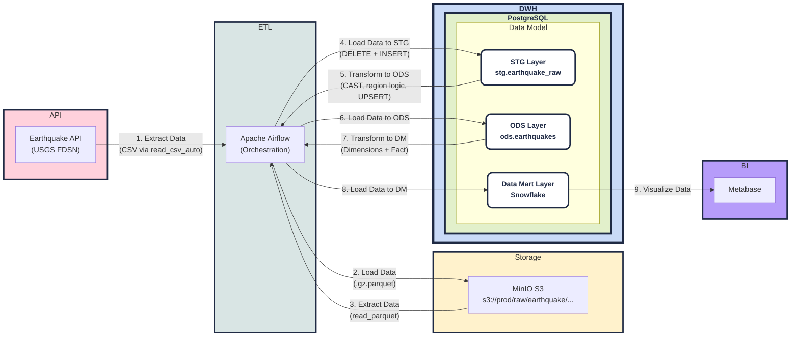

# pet_project_earhquake

Pet-проект по дата-инжинирингу для построения аналитического контура по землетрясениям на основе открытых данных USGS.

Проект реализует полный ETL/ELT-процесс: данные забираются из внешнего API, сохраняются в объектное хранилище, загружаются в staging-слой, затем преобразуются в ODS и агрегируются в витринный (DM) слой по модели «звезда» для последующей аналитики и визуализации.

Оркестрация пайплайнов выполняется в Apache Airflow через набор взаимосвязанных DAG'ов. Для локальной инфраструктуры используются Docker Compose, MinIO (S3-совместимое хранилище), PostgreSQL (DWH) и Metabase (BI-слой).

Основная цель проекта - отработать практический подход к построению многоуровневого DWH-пайплайна с идемпотентной загрузкой, декомпозицией по слоям данных и подготовкой данных для BI-отчетности.

## Создание виртуального окружения

```bash
python3.12 -m venv venv && \
source venv/bin/activate && \
pip install --upgrade pip && \
pip install -r requirements.txt
```

## Разворачивание инфраструктуры

```bash
docker-compose up -d
```

## Предварительная настройка MinIO and PostgreSQL для Airflow

После старта контейнеров необходимо настроить доступы, которые используются DAG-ами.

1. Откройте MinIO (`http://localhost:9001`) и войдите с дефолтными данными:
   - login: `minioadmin`
   - password: `minioadmin`
2. В MinIO создайте пару ключей доступа:
   - `access key`
   - `secret key`
3. Откройте Airflow (`http://localhost:8080`) и войдите с дефолтными данными:
    - login: `airflow`
    - password: `airflow`
4. В Airflow перейдите в `Admin -> Variables` и создайте переменные:
    - `access_key` - значение `access key` из MinIO
    - `secret_key` - значение `secret key` из MinIO
    - `pg_password` - `postgres` (как указано в `docker-compose.yaml` для `postgres_dwh`)
5. В Airflow перейдите в `Admin -> Connections` и создайте подключение к DWH:
   - Connection Id: `postgres_dwh`
   - Connection Type: `Postgres`
   - Host: `postgres_dwh`
   - Database: `postgres`
   - Login: `postgres`
   - Password: `postgres`
   - Port: `5432`

Без переменных и подключения `postgres_dwh` DAG-и не смогут корректно подключаться к MinIO и PostgreSQL.

## Предварительная настройка Metabase

Чтобы Metabase видел таблицы DWH, добавьте подключение к PostgreSQL:

1. Откройте Metabase (`http://localhost:3000`) и перейдите в создание/настройку подключения к базе.
2. Укажите параметры подключения:
   - Тип базы данных: `PostgreSQL`
   - Отображаемое имя: любое (например, `DWH`)
   - Host: `postgres_dwh`
   - Port: `5432`
   - Имя базы данных: `postgres`
   - Имя пользователя: `postgres`
   - Пароль: `postgres`
3. Сохраните подключение и выполните синхронизацию схемы, если таблицы не появились сразу.

Значения пользователя и пароля берутся из `docker-compose.yaml` (сервис `postgres_dwh`).

## Источники

- [Описание работы API](https://earthquake.usgs.gov/fdsnws/event/1/#methods)
- [Описание полей из API](https://earthquake.usgs.gov/data/comcat/index.php)

## Data Governance


### 1. Data Architecture

Архитектура проекта построена как многоуровневый пайплайн: `API -> RAW (S3) -> STG -> ODS -> DM -> BI`.

#### Диаграмма проекта



### 2. Data Modeling & Design

В проекте используется слой DM c фактом и измерениями (snowflake-подход), чтобы удобно строить BI-аналитику и переиспользовать измерения.

При этом логика событий остается близкой к `_AS IS_`: зерно факта - одно событие землетрясения (`id`) без историзации SCD.

### 3. Data Storage & Operations

#### Storage

- Cold/Warm storage - MinIO S3 (`raw` слой)
- Hot storage - PostgreSQL (`stg`, `ods`, `dm`)

#### Compute/Operations

- DuckDB - загрузка из API и работа с Data Lake
- PostgreSQL - ODS/DM слой и аналитические витрины
- Apache Airflow - оркестрация DAG-ов и расписание

### 4. Data Security

Безопасность реализуется на уровне:

- пользователей и ключей доступа в MinIO (`access key`/`secret key`),
- ролевой модели и доступов в PostgreSQL,
- ролей и подключений в Airflow/Metabase.

При необходимости может быть добавлена интеграция с LDAP/SSO.

### 5. Data Integration & Interoperability

В текущем проекте интеграции с внешними корпоративными системами не реализованы, так как цель - демонстрация полного локального ETL/ELT-контура.

Ключевая совместимость достигается за счет четкого разделения слоев (`stg` -> `ods` -> `dm`) и приведения типов/структуры на этапе ODS.

### 6. Documents & Content

Документация проекта включает:

- основной `README.md`,
- DDL и SQL-примеры в `sql/schemas/`, `sql/graphic/`, `sql/analytics/`,
- DAG-код и SQL-трансформации в `dags/`.

### 7. Reference & Master Data

RAW-данные в S3 сохраняются из источника в формате `_as is_` и используются как первичная, неизменяемая основа загрузки.

Изменения и обогащение выполняются на уровнях `ods` и `dm`, где формируется аналитическая модель.

### 8. Data Warehousing & Business Intelligence

Хранилище DWH построено на PostgreSQL, BI-слой реализован в Metabase.

Практические правила для витрин:

1. Регулярно пересматривать актуальность витрин и удалять неиспользуемые.
2. Управлять доступами к отчетам по ролям пользователей.
3. Стандартизировать подход к формированию витрин и метрик.
4. Мониторить нагрузку, производительность и частоту обновлений.
5. Автоматизировать обновление витрин и минимизировать ручные операции.

### 9. Meta-data

Метаданные частично заданы через структуру DWH и документацию запросов.

Дополнительно можно развивать каталог метаданных:

- комментарии к таблицам/колонкам в PostgreSQL,
- дата-каталог (например, OpenMetadata или DataHub).

Полезный внешний словарь полей источника:

- [Описание полей из API](https://earthquake.usgs.gov/data/comcat/index.php)

### 10. Data Quality

В проекте реализованы базовые проверки качества данных:

- сверка количества записей между `ods.earthquakes` и `dm.fact_earthquakes`,
- контроль отсутствующих событий в факте,
- контроль `NULL` во внешних ключах факта.

Примеры запросов для Data Quality находятся в `sql/analytics/01_data_quality_checks.sql`.

## SQL-файлы

- DDL схем и таблиц: `sql/schemas/01_create_schemas_and_tables.sql`
- SQL для визуализаций в Metabase: `sql/graphic/`
- Примеры аналитических SQL-запросов: `sql/analytics/`
- SQL-проверки качества данных: `sql/data_quality/`
