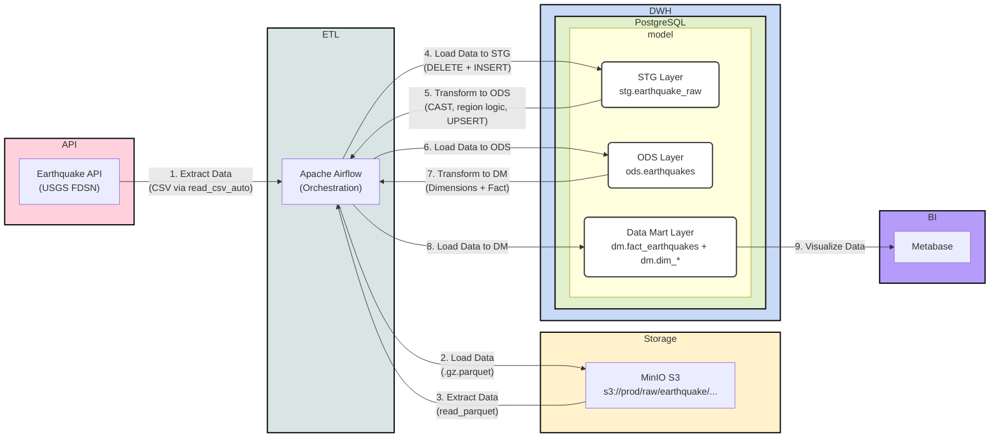

# pet_project_earhquake

Pet-проект по дата-инжинирингу для построения аналитического контура по землетрясениям на основе открытых данных USGS.

Проект реализует полный ETL/ELT-процесс: данные забираются из внешнего API, сохраняются в объектное хранилище, загружаются в staging-слой, затем преобразуются в ODS и агрегируются в витринный (DM) слой по модели «звезда» для последующей аналитики и визуализации.

Оркестрация пайплайнов выполняется в Apache Airflow через набор взаимосвязанных DAG'ов. Для локальной инфраструктуры используются Docker Compose, MinIO (S3-совместимое хранилище), PostgreSQL (DWH) и Metabase (BI-слой).

Основная цель проекта - отработать практический подход к построению многоуровневого DWH-пайплайна с идемпотентной загрузкой, декомпозицией по слоям данных и подготовкой данных для BI-отчетности.

## Создание виртуального окружения

```bash
python3.12 -m venv venv && \
source venv/bin/activate && \
pip install --upgrade pip && \
pip install -r requirements.txt
```

## Разворачивание инфраструктуры

```bash
docker-compose up -d
```

## Предварительная настройка MinIO and PostgreSQL в Airflow

После старта контейнеров необходимо настроить доступы, которые используются DAG-ами.

1. Откройте MinIO (`http://localhost:9001`) и войдите с дефолтными данными:
   - login: `minioadmin`
   - password: `minioadmin`
2. В MinIO создайте пару ключей доступа:
   - `access key`
   - `secret key`
3. Откройте Airflow (`http://localhost:8080`) и войдите с дефолтными данными:
    - login: `airflow`
    - password: `airflow`
4. В Airflow перейдите в `Admin -> Variables` и создайте переменные:
    - `access_key` - значение `access key` из MinIO
    - `secret_key` - значение `secret key` из MinIO
    - `pg_password` - `postgres` (как указано в `docker-compose.yaml` для `postgres_dwh`)
5. В Airflow перейдите в `Admin -> Connections` и создайте подключение к DWH:
   - Connection Id: `postgres_dwh`
   - Connection Type: `Postgres`
   - Host: `postgres_dwh`
   - Database: `postgres`
   - Login: `postgres`
   - Password: `postgres`
   - Port: `5432`

Без переменных и подключения `postgres_dwh` DAG-и не смогут корректно подключаться к MinIO и PostgreSQL.

## Источники

- [Описание работы API](https://earthquake.usgs.gov/fdsnws/event/1/#methods)
- [Описание полей из API](https://earthquake.usgs.gov/data/comcat/index.php)

## Диаграмма проекта


